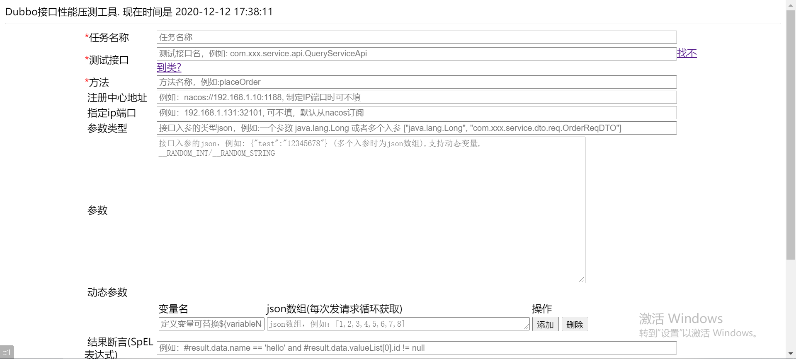
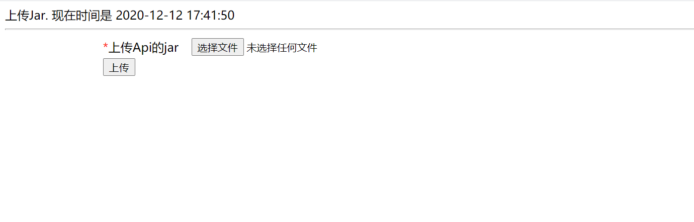
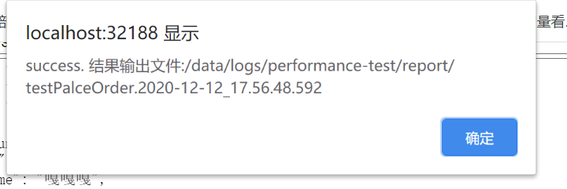

# performance-test-platform
A Web application that supports tests HTTP and Dubbo performance.

# Quick start
## 1. Fork and run the spring boot application.
```shell script
run com.okeeper.performance.PerformanceApplication
```

## 2. Visit index html.

You can see the index html. It's is default performance tests for Dubbo interface.
index url: `http://localhost:32188/`


## 3. Config the request parameters
It's simple to understands with the input tips. Just try it.

## 4. Upload your Api JAR
After config, you should upload your `Dubbo Interface` api jar to the server classloader context, otherwise it
will throw Exception of `找不到接口`
upload url: `http://localhost:32188/uploadJar`, and you can also see the click tag after the '测试接口' input.


## Submit
If you fill in all parameters correctly. you can see this alert widow.


## Observe the backend log
In the last step, Alert success does not necessarily mean success, there may be asynchronous errors.
so you should observe the log in the backend.

## See performance report
The test report will output int the path `/data/logs/performance-test/report/`, and the detail file name it was alert you in the web Alert window.

Example result.
```shell script
Desc | Threads | Total Times (cnt) | Total Cost (ms) | Measure Times (cnt) | Successful Times(cnt) | Failed Times (cnt) | Throughput (qps/s) | Successful Rate (%) | Max Cost (ms) | Average Time (ms) | Tp99 (ms) | Tp95 (ms) | Tp90 (ms) | Tp50 (ms)
Final Result:  | 1 | 1 | 5068 | 1 | 0 | 1 | 0.1973164975643158 | 0.0 | 0 | 0.0 | 0.0 | 0.0 | 0.0 | 0.0

```
